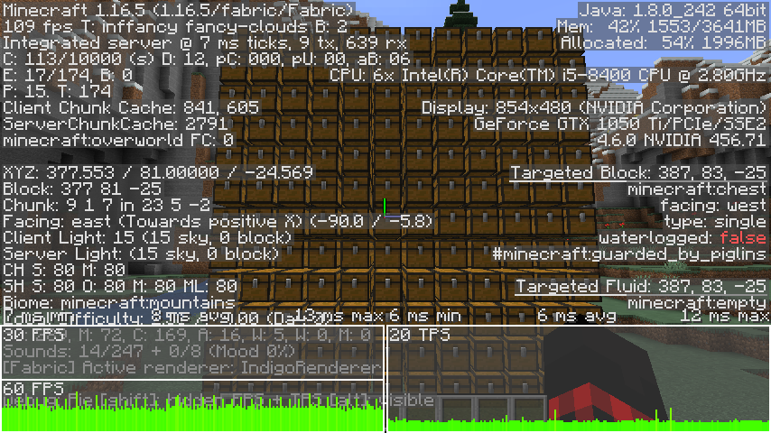
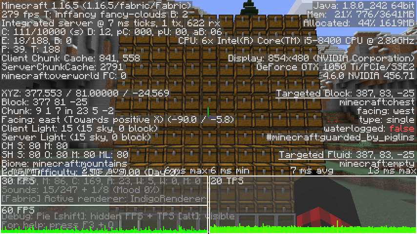

## Enhanced Block Entities

EBE is a mod for Minecraft on the Fabric mod loader which aims to increase the performance of block entity rendering, as well as offer customizability via resource packs.

### Vanilla

### With EBE

